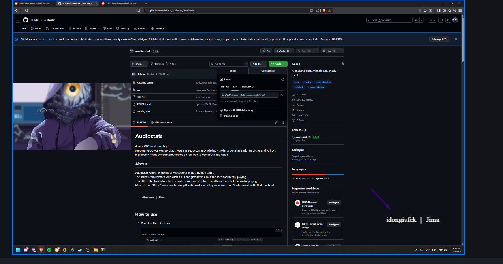

# Audiostats


A customizable OBS music overlay that displays currently playing media information in real-time using Windows' native media API.

## Screenshots

### Shorter Titles



### Longer Titless


## How to Use

### Step 1: Download and Extract

Download the latest release from the [releases page](https://github.com/yourusername/audiostats/releases).


Extract the ZIP file to a folder of your choice.


### Step 2: Add to OBS

Open OBS Studio and add a new source by clicking the **+** button in the Sources panel.


Select **Browser** from the list.


### Step 3: Configure Browser Source

- check Local File 
- Click **Browse** and select the `audiostats.html` file 
- I personally Set the width to **200** and height to **50**


### Step 4: Run the Application

Navigate to the extracted folder and run `audiostat.exe`.


**Important:** Windows Defender may flag the executable. This is a common false positive with PyInstaller-compiled applications.

To allow the program to run:

1. Click **More info**


2. Click **Run anyway**


### Step 5: It now works ! 

You should see a console window displaying the current media information. The OBS overlay will now update automatically when you play a new media.


##  Development Setup

### Requirements

- **Python 3.9.x** (Required - other versions are not compatible due to WinRT dependencies)
- Windows 10 or later

### Dependencies

Install the required Python packages:

```bash
pip install winrt==1.0.21033.1
pip install websockets==11.0.3
```
**OR**
```bash
pip install -r src/requirements.txt
```

Built-in modules (I think no installation is needed):
- `asyncio`
- `json`

---

This project is licensed under the GPL-3.0 License - see the [LICENSE](LICENSE) file for details.

**Questions or Issues?** Open an issue on GitHub !


