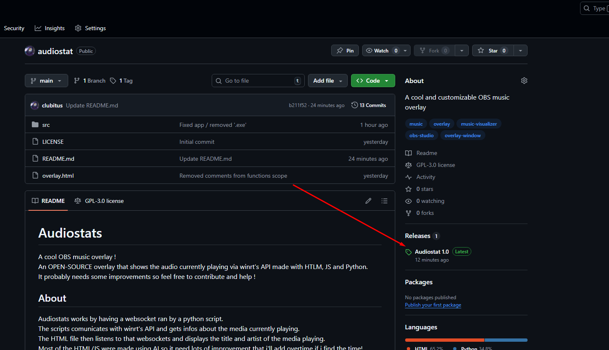
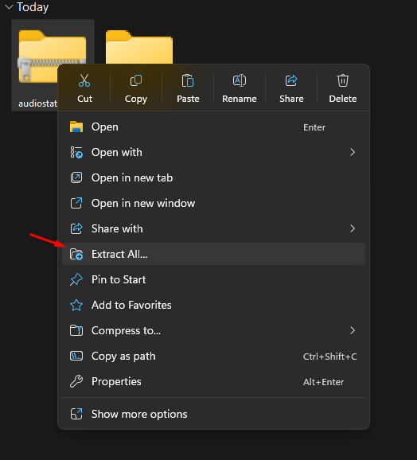
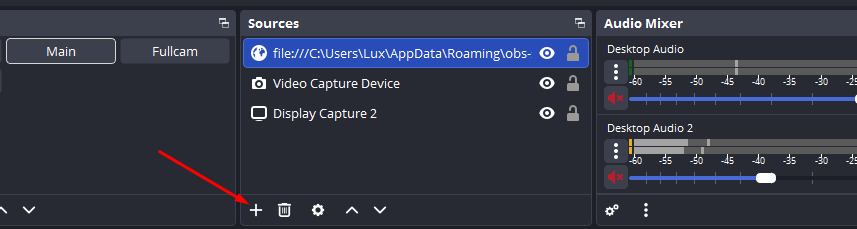
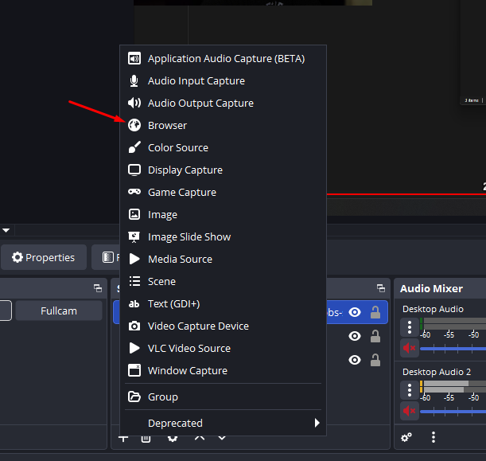
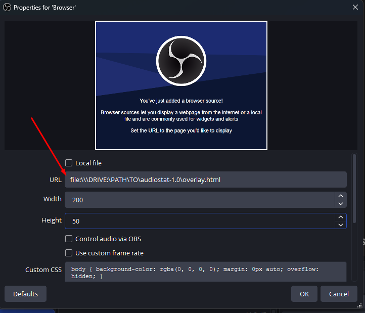
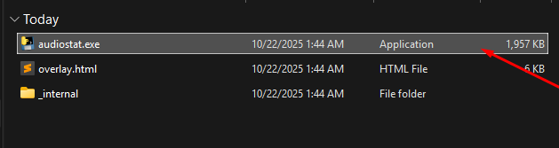
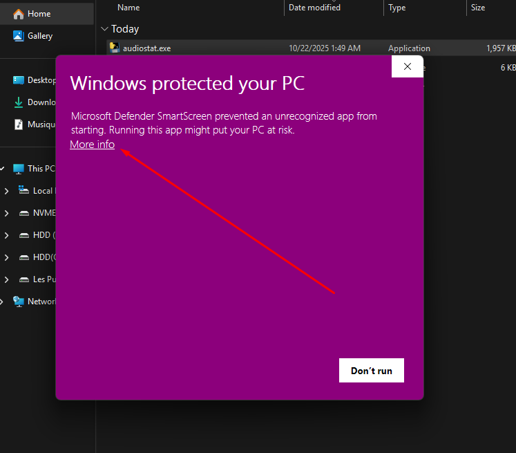
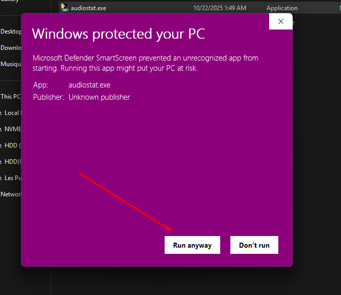
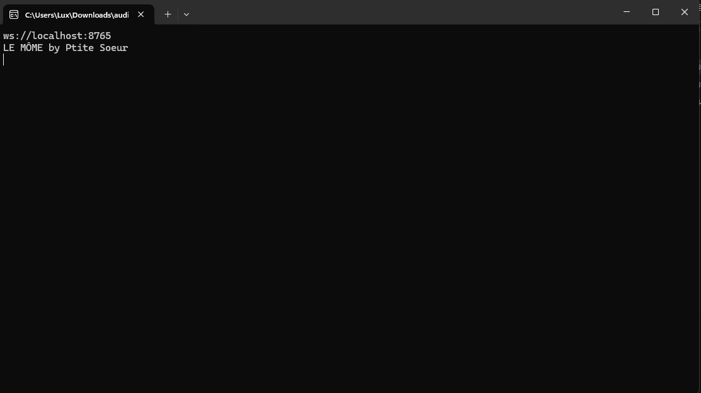

# Audiostats

<p>A cool OBS music overlay !<br>
An OPEN-SOURCE overlay that shows the audio currently playing via winrt's API made with HTLM, JS and Python.<br>
It probably needs some improvements so feel free to contribute and help !
</p>

## About

<p>Audiostats works by having a websocket ran by a python script.<br>
The scripts comunicates with winrt's API and gets infos about the media currently playing.<br>
The HTML file then listens to that websockets and displays the title and artist of the media playing.<br>
Most of the HTML/JS were made using AI so it need lots of improvement that i'll add overtime if i find the time!</p>

## How to use 

1. Download latest release
   
   

2. Unzip file
   
   

3. Add new source in OBS
   
   

4. Select browser
   
   

5. Put file link and browser size (I recommend W:200 H:50 for browser size)
   
   

6. Run audiostat.exe
   
   

7. Windows Defender will probably flag it, here's the bypass:
   
   
   
   

8. This should be what you see when you run the program (different title and artist OBVIOUSLY). Now if you play a new media, the OBS source should display the name and the artist.
   
   
   
   

   
## Requirements to modify the program

The program runs with python 3.9.x it wont work with another version and the ".exe" is compiled with Pyinstaller

here's a list of all libraries used :

- winrt (```1.0.21033.1``` is the version I use)
- websockets (```11.0.3``` is the version I use)
- asyncio (came with my conda environement, don't think it needs/should be installed with pip)
- json (came with my conda environement, don't think it needs/should be installed with pip)

## More

Feel free to help improve the project !
If you have requests I might be able to help, keep in mind that I'm not good at this though !

---

*This project is licensed under the GPL-3.0 License - see the LICENSE file for details.*


*Last updated: 10/21/2025*


